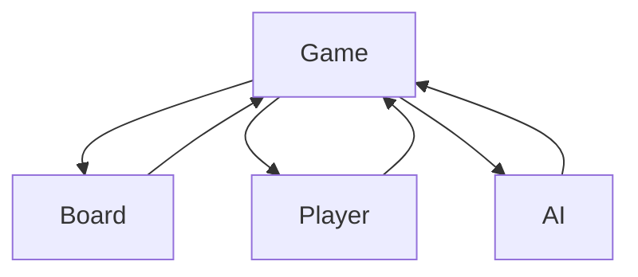

# 🎮 Engenharia de Requisitos
## Estudo de Caso: Jogo da Velha

---
# 🧭 Objetivo da Atividade
Mostrar que iniciar pela codificação sem requisitos gera suposições, retrabalho e risco de rejeição.

---
# 🔥 Provocação Inicial
"Desenvolva um Jogo da Velha." (sem contexto)
- Sem regras escritas
- Sem requisitos definidos
- Sem critérios de aceitação
➡ Cada pessoa cria algo diferente

---
# ❓ Pergunta-Chave
### Como você sabe se o cliente vai aceitar a sua solução?
Sem requisitos: não há acordo, escopo, nem teste objetivo.

---
# 👥 Stakeholders
| Papel | Interesse | Influência | Observações |
|-------|-----------|------------|-------------|
| Jogador Humano | Usabilidade | Média | Público infantil alvo |
| Cliente/Educador | Engajamento | Alta | Define escopo inicial |
| Desenvolvedor | Qualidade técnica | Média | Implementa e mantém |
| Motor IA (futuro) | Desafio | Baixa | Extensão opcional |

---
# 📌 Escopo Inicial
Incluído:
- Tabuleiro 3×3
- PvP (Jogador vs Jogador)
- PvE (Jogador vs IA simples)
- Detecção de vitória/empate
- Reiniciar partida
Excluído (fora do escopo): placar persistente, dificuldade avançada de IA, skins temáticas.

---
# 📝 Elicitação Usada
- Entrevista (preferência de uso: navegador)
- Observação (crianças jogando versão papel)
- Brainstorming (features desejadas)
- Protótipo baixa fidelidade (wireframe do tabuleiro)

Principais descobertas: navegador, interface amigável, PvP, IA simples, feedback imediato.

---
# 🔧 Requisitos Funcionais (RF)
| ID | Descrição | Critério de Aceitação |
|----|-----------|-----------------------|
| RF01 | Iniciar jogo com tabuleiro vazio | 9 células limpas ao carregar |
| RF02 | Alternar turno PvP | Símbolo alterna a cada jogada válida |
| RF03 | Jogar vs IA simples | IA joga em célula livre após humano |
| RF04 | Registrar e exibir jogada | Célula mostra X ou O imediatamente |
| RF05 | Detectar vitória | Mensagem mostra linha vencedora instantânea |
| RF06 | Detectar empate | Mensagem "Empate" após 9 jogadas sem vitória |
| RF07 | Exibir resultado | Vitória ou empate visível em destaque |
| RF08 | Reiniciar partida | Tabuleiro reseta e turno volta para X |

---
# 🔒 Requisitos Não Funcionais (RNF)
| ID | Categoria | Descrição | Métrica |
|----|-----------|-----------|--------|
| RNF01 | Usabilidade | Interface clara para crianças | Aprendizado < 2 min |
| RNF02 | Performance | Resposta à jogada | < 50 ms após clique |
| RNF03 | Portabilidade | Navegadores modernos | Chrome/Firefox/Edge atuais |
| RNF04 | Confiabilidade | Bloquear jogadas inválidas | 100% rejeição de célula ocupada |
| RNF05 | Acessibilidade | Navegação por teclado | Todas células focáveis |
| RNF06 | Manutenibilidade | Código modular IA | Arquivo separado `ia.js` |

---
# 🧩 Regras de Negócio
- RN01: Jogador 1 usa "X"; Jogador 2 ou IA usa "O".
- RN02: "X" sempre inicia a partida.
- RN03: Após vitória ou empate, novas jogadas são bloqueadas até reiniciar.
- RN04: A IA nunca joga em célula ocupada.

---
# 🙋 User Stories
- Como jogador quero ver de quem é o turno para evitar confusão.
- Como jogador quero reiniciar o jogo rapidamente para jogar várias partidas seguidas.
- Como jogador quero saber imediatamente se venci para comemorar.
- Como jogador quero saber se empatou para encerrar a partida.
- Como jogador quero jogar contra o computador para praticar sozinho.

---
# ✅ Critérios de Aceitação (Exemplos)
RF05 Vitória:
Dado tabuleiro com duas marcas "X" na mesma linha
Quando o jogador marca a terceira célula
Então o sistema exibe "Vitória de X" e bloqueia jogadas.

RF06 Empate:
Dado tabuleiro sem vitória após 8 jogadas
Quando ocorre a nona jogada
Então o sistema exibe "Empate".

---
# 🔗 Rastreabilidade (Trecho)
| Requisito | Origem | User Story | Teste |
|-----------|--------|-----------|-------|
| RF05 | Observação + Brainstorm | Vitória imediata | TC_VIT_Linha |
| RF06 | Entrevista | Detectar fim | TC_EMPATE_9 |
| RNF02 | Entrevista | Resposta rápida | TC_PERF_Click |

---
# 🧱 Diagrama de Classes (Mermaid)

Responsabilidades:
- Game: orquestra fluxo, verifica fim
- Board: estado das células
- Player: símbolo X/O
- AI: escolhe jogada válida

---
# 📇 Modelo CRC
| Classe | Responsabilidades | Colabora |
|--------|-------------------|----------|
| Game | Turnos, validação, fim | Board, Player, AI |
| Board | Armazena estado | Game, AI |
| Player | Fornece símbolo | Game |
| AI | Estratégia simples | Game, Board |

---
# 📄 Estrutura SRS (Resumo)
1. Introdução (objetivo, escopo)  
2. Descrição Geral (usuários, plataforma)  
3. Requisitos Funcionais  
4. Requisitos Não Funcionais  
5. Regras de Negócio  
6. Modelos (UML/Mermaid, CRC)  
7. Critérios de Aceitação  
8. Rastreabilidade  
9. Anexos (wireframes)

---
# ⚠️ Riscos & Mitigações
| Risco | Impacto | Mitigação |
|-------|---------|-----------|
| Escopo cresce (features extras) | Retrabalho | Documentar out-of-scope |
| Ambiguidade em IA | Inconsistência | Definir regra: escolher primeira célula livre |
| Falta de acessibilidade | Usuários excluídos | Testar navegação teclado |

---
# 🚀 Extensões Futuras (Out-of-Scope)
- Dificuldade variável da IA
- Placar persistente
- Tabuleiros maiores (4×4, 5×5)
- Ranking online

Documentar para evitar escopo oculto.

---
# 🛠 Boas Práticas Aplicadas
- Separação RF vs RNF
- Critérios de aceitação testáveis
- Rastreabilidade início (origem → teste)
- Uso de métricas claras em RNF
- Identificação de riscos cedo

---
# 🧪 Quiz (mantido)
Pergunta: Por que não iniciar pela programação?  
Resposta correta: Sem requisitos não há clareza nem garantia de aceitação.
(Adaptar slides de quiz originais se desejar interatividade.)

---
# 🏁 Conclusão
Requisitos estruturam a comunicação, reduzem retrabalho e dão critérios objetivos de aceitação antes da codificação.

---
# 📚 Próximo Passo
Implementar protótipo validando cada critério de aceitação e registrar testes.

---
# ✅ Checklist Final
- RF claros? ✔
- RNF mensuráveis? ✔
- Critérios de aceitação definidos? ✔
- Escopo/out-of-scope explícito? ✔
- Modelagem coerente? ✔
- Riscos analisados? ✔

---
# 🙌 Fim
Dúvidas?
