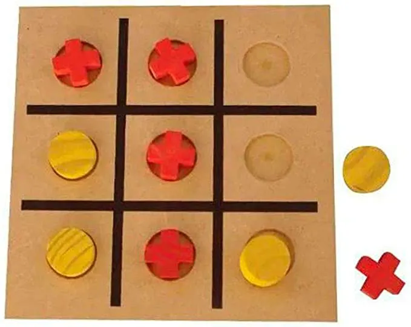
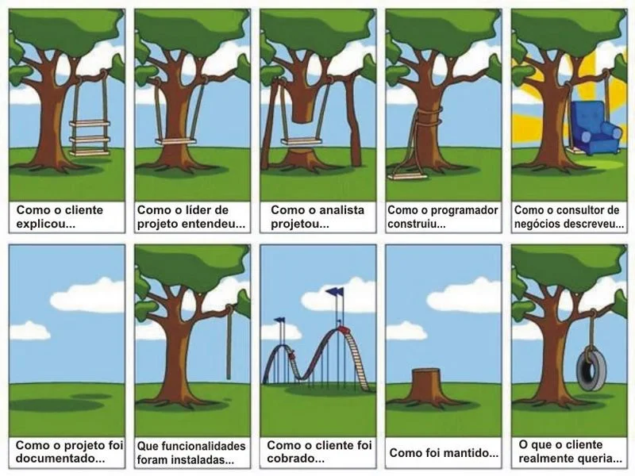
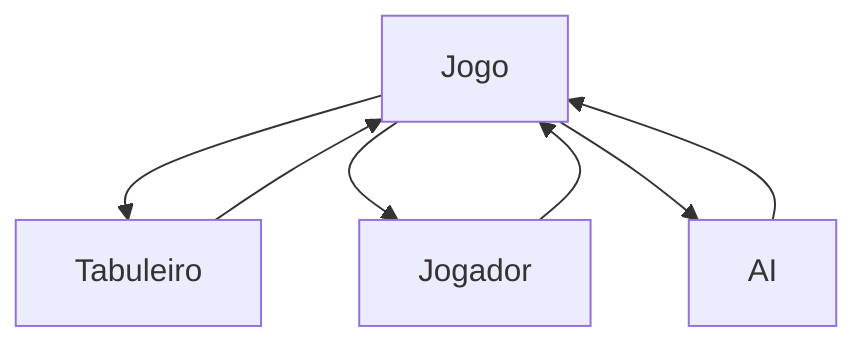

# 🎮 Engenharia de Requisitos

## Estudo de Caso: Jogo da Velha

---

# 🧭 Objetivo da Atividade

* Mostrar que iniciar pela codificação sem requisitos gera suposições, retrabalho e risco de rejeição.
* Compreender o que é requisitos
* A importancia da Elicitação de Requisitos
* Q

---

# 🔥 Provocação Inicial

"Desenvolva um Jogo da Velha." (sem contexto)

- Sem regras escritas
- Sem requisitos definidos
- Sem critérios de aceitação
  ➡ Cada pessoa cria algo diferente

---

## ❓ Pergunta-Chave

### Como você sabe se o cliente vai aceitar a sua solução?

Sem requisitos: não há acordo, escopo, nem teste objetivo.

---

## 📘 Definições Fundamentais de Requisitos

**Requisito (IEEE 29148):** condição ou capacidade necessária a um usuário ou sistema para atingir objetivo ou resolver problema.

| Termo                          | Definição Resumida                                        | Observação             |
| ------------------------------ | ----------------------------------------------------------- | ------------------------ |
| Requisito Funcional (RF)       | Serviço, comportamento que o sistema deve fornecer         | "Detectar vitória"      |
| Requisito Não Funcional (RNF) | Restrição ou atributo de qualidade                        | "Resposta < 50 ms"       |
| Regra de Negócio (RN)         | Política ou decisão de domínio que orienta comportamento | "X sempre inicia"        |
| User Story                     | Forma leve centrada no usuário                             | "Como jogador quero..."  |
| Critério de Aceitação       | Condição objetiva para considerar requisito atendido      | Cenários Gherkin        |
| Escopo                         | Limites do que será entregue nesta fase                    | Exclui tabuleiro 4×4    |
| Rastreabilidade                | Seguir origem → implementação → teste                   | Matriz requisitos/testes |

**Características de bons requisitos:**

- Claros (linguagem sem ambiguidade)
- Atômicos (uma ideia por requisito)
- Verificáveis (teste mensurável possível)
- Necessários (agregam valor real)
- Consistentes (sem conflito com outros)
- Rastreáveis (ID único, origem conhecida)
- Sem solução embutida (focam na necessidade, não em tecnologia específica)

**Exemplos rápidos:**

- RF: "Exibir mensagem de vitória ao completar três símbolos alinhados." (Comportamento)
- RNF: "Tempo de resposta à jogada < 50 ms." (Desempenho)
- RN: "Após vitória, bloquear novas jogadas." (Regra de domínio)

> Dica: usar cores distintas (RF, RNF, RN) para visualização.

---

## 🔍 Definição: Elicitação de Requisitos

**Elicitar** = descobrir, levantar e compreender necessidades, expectativas, restrições e regras do domínio junto às fontes (stakeholders, documentos, observação, sistemas existentes).

| Aspecto        | Descrição                                                                                             |
| -------------- | ------------------------------------------------------------------------------------------------------- |
| Objetivo       | Obter informações brutas antes de qualquer decisão técnica                                          |
| Entradas       | Stakeholders identificados, contexto de negócio, legado, metas                                         |
| Saídas        | Lista inicial de requisitos (não refinados), hipóteses, lacunas                                       |
| Técnicas      | Entrevistas, observação, brainstorming, workshops, questionários, protótipos, análise de documento |
| Erros Comuns   | Perguntas direcionadas, falta de registro, ignorar usuários extremos, suposições não validadas      |
| Boas Práticas | Escuta ativa, perguntas abertas, registrar fonte, validar entendimentos periodicamente                  |

**Indicador de qualidade:** cada requisito deve ter origem explícita (Ex.: Entrevista Stakeholder A, Workshop 12/11).

---

## 🧪 Definição: Análise de Requisitos

**Analisar** = transformar o conjunto bruto levantado em um conjunto estruturado, consistente, priorizado, sem ambiguidades e pronto para modelagem e validação.

| Aspecto        | Descrição                                                                                                                                      |
| -------------- | ------------------------------------------------------------------------------------------------------------------------------------------------ |
| Objetivo       | Refinar e estruturar (classificar, priorizar, resolver conflitos)                                                                                |
| Entradas       | Requisitos brutos da elicitação, regras de negócio preliminares                                                                               |
| Saídas        | Requisitos classificados (RF/RNF/RN), priorizados, com critérios de aceitação iniciais                                                        |
| Atividades     | Classificação, decomposição, remoção de duplicidades, padronização de linguagem, definição de critérios, identificação de conflitos |
| Técnicas      | MoSCoW, Kano (simplificado), protótipo de validação, revisão por pares, modelagem de domínio                                                |
| Erros Comuns   | Misturar solução com necessidade, requisitos vagos, ausência de critério mensurável                                                         |
| Boas Práticas | Usar vocabulário controlado, separar desejo vs necessidade, documentar decisões de priorização                                               |

**Indicador de qualidade:** ausência de termos ambíguos ("rápido", "fácil", "melhor") sem métricas.

---

# 👥 Stakeholders

| Papel             | Interesse          | Influência | Observações          |
| ----------------- | ------------------ | ----------- | ---------------------- |
| Jogador Humano    | Usabilidade        | Média      | Público infantil alvo |
| Cliente/Educador  | Engajamento        | Alta        | Define escopo inicial  |
| Desenvolvedor     | Qualidade técnica | Média      | Implementa e mantém   |
| Motor IA (futuro) | Desafio            | Baixa       | Extensão opcional     |

---

# 📌 Escopo Inicial

Incluído:

- Tabuleiro 3×3
- PvP (Jogador vs Jogador)
- PvE (Jogador vs IA simples)
- Detecção de vitória/empate
- Reiniciar partida
  Excluído (fora do escopo): placar persistente, dificuldade avançada de IA, skins temáticas.

---

# 📝 Elicitação Usada

- Entrevista (preferência de uso: navegador)
- Observação (crianças jogando versão papel)
- Brainstorming (features desejadas)
- Protótipo baixa fidelidade (wireframe do tabuleiro)

Principais descobertas: navegador, interface amigável, PvP, IA simples, feedback imediato.

---

# 🔧 Requisitos Funcionais (RF)

| ID   | Descrição                      | Critério de Aceitação                       |
| ---- | -------------------------------- | ---------------------------------------------- |
| RF01 | Iniciar jogo com tabuleiro vazio | 9 células limpas ao carregar                  |
| RF02 | Alternar turno PvP               | Símbolo alterna a cada jogada válida         |
| RF03 | Jogar vs IA simples              | IA joga em célula livre após humano          |
| RF04 | Registrar e exibir jogada        | Célula mostra X ou O imediatamente            |
| RF05 | Detectar vitória                | Mensagem mostra linha vencedora instantânea   |
| RF06 | Detectar empate                  | Mensagem "Empate" após 9 jogadas sem vitória |
| RF07 | Exibir resultado                 | Vitória ou empate visível em destaque        |
| RF08 | Reiniciar partida                | Tabuleiro reseta e turno volta para X          |

---

# 🔒 Requisitos Não Funcionais (RNF)

| ID    | Categoria        | Descrição                    | Métrica                           |
| ----- | ---------------- | ------------------------------ | ---------------------------------- |
| RNF01 | Usabilidade      | Interface clara para crianças | Aprendizado < 2 min                |
| RNF02 | Performance      | Resposta à jogada             | < 50 ms após clique               |
| RNF03 | Portabilidade    | Navegadores modernos           | Chrome/Firefox/Edge atuais         |
| RNF04 | Confiabilidade   | Bloquear jogadas inválidas    | 100% rejeição de célula ocupada |
| RNF05 | Acessibilidade   | Navegação por teclado        | Todas células focáveis           |
| RNF06 | Manutenibilidade | Código modular IA             | Arquivo separado `ia.js`         |

---

# 🧩 Regras de Negócio

- RN01: Jogador 1 usa "X"; Jogador 2 ou IA usa "O".
- RN02: "X" sempre inicia a partida.
- RN03: Após vitória ou empate, novas jogadas são bloqueadas até reiniciar.
- RN04: A IA nunca joga em célula ocupada.

---

# 🙋 User Stories

- Como jogador quero ver de quem é o turno para evitar confusão.
- Como jogador quero reiniciar o jogo rapidamente para jogar várias partidas seguidas.
- Como jogador quero saber imediatamente se venci para comemorar.
- Como jogador quero saber se empatou para encerrar a partida.
- Como jogador quero jogar contra o computador para praticar sozinho.

---

# ✅ Critérios de Aceitação (Exemplos)

RF05 Vitória:
Dado tabuleiro com duas marcas "X" na mesma linha
Quando o jogador marca a terceira célula
Então o sistema exibe "Vitória de X" e bloqueia jogadas.

RF06 Empate:
Dado tabuleiro sem vitória após 8 jogadas
Quando ocorre a nona jogada
Então o sistema exibe "Empate".

---

# 🔗 Rastreabilidade (Trecho)

| Requisito | Origem                    | User Story        | Teste         |
| --------- | ------------------------- | ----------------- | ------------- |
| RF05      | Observação + Brainstorm | Vitória imediata | TC_VIT_Linha  |
| RF06      | Entrevista                | Detectar fim      | TC_EMPATE_9   |
| RNF02     | Entrevista                | Resposta rápida  | TC_PERF_Click |

---

# 🧱 Diagrama de Classes (Mermaid)

```mermaid
graph TD
A[Jogo] --> B[Tabuleiro]
A --> C[Jogador]
A --> D[AI]
B --> A
C --> A
D --> A
```

Responsabilidades:

- Game: orquestra fluxo, verifica fim
- Board: estado das células
- Player: símbolo X/O
- AI: escolhe jogada válida

---

# 📇 Modelo CRC

| Classe | Responsabilidades        | Colabora          |
| ------ | ------------------------ | ----------------- |
| Game   | Turnos, validação, fim | Board, Player, AI |
| Board  | Armazena estado          | Game, AI          |
| Player | Fornece símbolo         | Game              |
| AI     | Estratégia simples      | Game, Board       |

---

# 📄 Estrutura SRS (Resumo)

1. Introdução (objetivo, escopo)
2. Descrição Geral (usuários, plataforma)
3. Requisitos Funcionais
4. Requisitos Não Funcionais
5. Regras de Negócio
6. Modelos (UML/Mermaid, CRC)
7. Critérios de Aceitação
8. Rastreabilidade
9. Anexos (wireframes)

---

# ⚠️ Riscos & Mitigações

| Risco                           | Impacto              | Mitigação                                    |
| ------------------------------- | -------------------- | ---------------------------------------------- |
| Escopo cresce (features extras) | Retrabalho           | Documentar out-of-scope                        |
| Ambiguidade em IA               | Inconsistência      | Definir regra: escolher primeira célula livre |
| Falta de acessibilidade         | Usuários excluídos | Testar navegação teclado                     |

---

# 🚀 Extensões Futuras (Out-of-Scope)

- Dificuldade variável da IA
- Placar persistente
- Tabuleiros maiores (4×4, 5×5)
- Ranking online

Documentar para evitar escopo oculto.

---

# 🛠 Boas Práticas Aplicadas

- Separação RF vs RNF
- Critérios de aceitação testáveis
- Rastreabilidade início (origem → teste)
- Uso de métricas claras em RNF
- Identificação de riscos cedo

---

# 🧪 Quiz (mantido)

Pergunta: Por que não iniciar pela programação?
Resposta correta: Sem requisitos não há clareza nem garantia de aceitação.
(Adaptar slides de quiz originais se desejar interatividade.)

---

# 🏁 Conclusão

Requisitos estruturam a comunicação, reduzem retrabalho e dão critérios objetivos de aceitação antes da codificação.

---

# 📚 Próximo Passo

Implementar protótipo validando cada critério de aceitação e registrar testes.

---

# ✅ Checklist Final

- RF claros? ✔
- RNF mensuráveis? ✔
- Critérios de aceitação definidos? ✔
- Escopo/out-of-scope explícito? ✔
- Modelagem coerente? ✔
- Riscos analisados? ✔

---

# 🙌 Fim

Dúvidas?
