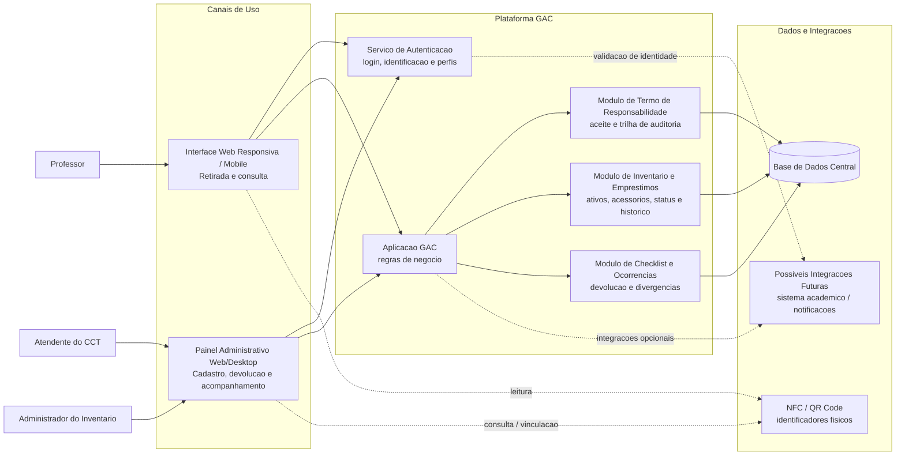

# Arquitetura Proposta - GAC

```mermaid
flowchart LR
    professor[Professor]
    atendente[Atendente do CCT]
    admin[Administrador do Inventario]

    subgraph uso[Canais de Uso]
        mobile[Interface Web Responsiva / Mobile\nRetirada e consulta]
        desktop[Painel Administrativo Web/Desktop\nCadastro, devolucao e acompanhamento]
    end

    subgraph nucleo[Plataforma GAC]
        auth[Servico de Autenticacao\nlogin, identificacao e perfis]
        app[Aplicacao GAC\nregras de negocio]
        termo[Modulo de Termo de Responsabilidade\naceite e trilha de auditoria]
        inventario[Modulo de Inventario e Emprestimos\nativos, acessorios, status e historico]
        ocorrencias[Modulo de Checklist e Ocorrencias\ndevolucao e divergencias]
    end

    subgraph dados[Dados e Integracoes]
        db[(Base de Dados Central)]
        tags[NFC / QR Code\nidentificadores fisicos]
        futuro[Possiveis Integracoes Futuras\nsistema academico / notificacoes]
    end

    professor --> mobile
    atendente --> desktop
    admin --> desktop

    mobile --> auth
    desktop --> auth

    mobile --> app
    desktop --> app

    app --> termo
    app --> inventario
    app --> ocorrencias

    inventario --> db
    termo --> db
    ocorrencias --> db

    mobile -. leitura .-> tags
    desktop -. consulta / vinculacao .-> tags

    auth -. validacao de identidade .-> futuro
    app -. integracoes opcionais .-> futuro
```
