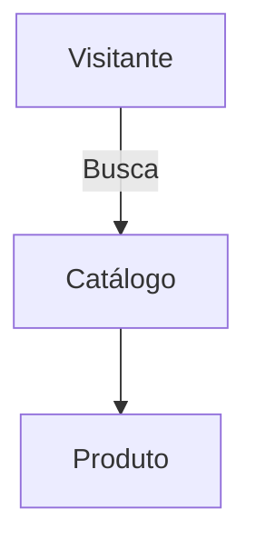

# Tutorial de Markdown — Guia Prático

Este tutorial ensina a escrever documentação em **Markdown (.md)** com exemplos práticos compatíveis com GitHub/VS Code.

## 1. Títulos e hierarquia
- Use `#` para título principal, depois `##`, `###`...
```md
# Título
## Seção
### Subseção
```

## 2. Ênfase (negrito/itálico)
```md
**Negrito** e *itálico* e ~~tachado~~
```

## 3. Listas
- Não ordenadas:
```md
- Item A
- Item B
  - Subitem B.1
```
- Ordenadas:
```md
1. Passo 1
2. Passo 2
```
- Tarefas (GFM):
```md
- [ ] A fazer
- [x] Concluído
```

## 4. Links e âncoras
- Link:
```md
[Plano_Semestral.md](Plano_Semestral.md)
```
- Âncora para seção (GitHub gera automaticamente pelo título):
```md
[Ir para Cronograma](Plano_Semestral.md#cronograma-semanal-16-semanas)
```

## 5. Imagens
- Use texto alternativo (acessibilidade):
```md

```

## 6. Código e comandos
- Inline:
```md
Use `pip install` para instalar.
```
- Blocos com linguagem:
```powershell
python -m venv .venv
.venv\Scripts\Activate.ps1
pip install pdfminer.six
```
```json
{ "name": "exemplo" }
```

## 7. Tabelas
```md
| Campo     | Valor        |
|-----------|--------------|
| Feirante  | João Silva   |
| Banca     | 12           |
```

## 8. Citações e divisões
```md
> Observação importante.

---
```

## 9. Diagramas (Mermaid)


## 10. Boas práticas
- Use títulos descritivos e hierarquia consistente.
- Prefira listas curtas e tabelas para dados tabulares.
- Imagens com nomes claros e `alt` informativo.
- Links **relativos** entre arquivos do repositório.
- Atualize o rodapé com data de última revisão.

## 11. Estrutura sugerida para arquivos
```md
# Nome do Documento

## Objetivo

## Conteúdo

## Referências

---
Última atualização: DD/MM/AAAA
```

## 12. Marp (slides em Markdown)
- Frontmatter mínimo:
```md
---
marp: true
theme: requisitos
class: requisitos, lead
paginate: true
footer: 'Disciplina • Tópico'
---
```
- Exportação para HTML/PDF via extensão Marp.

## 13. Erros comuns
- Usar `•` em vez de `-` para lista (não renderiza bem). Prefira `-`.
- Misturar espaços e tabs (padronize espaços).
- Linhas muito longas sem quebras — prefira parágrafos curtos.

## 14. Exemplos no repositório
- Veja [Guia_Documentacao.md](Guia_Documentacao.md), [Plano_Semestral.md](Plano_Semestral.md) e [feira-livre/artefatos](feira-livre/artefatos).

---
Última atualização: 17/01/2026
